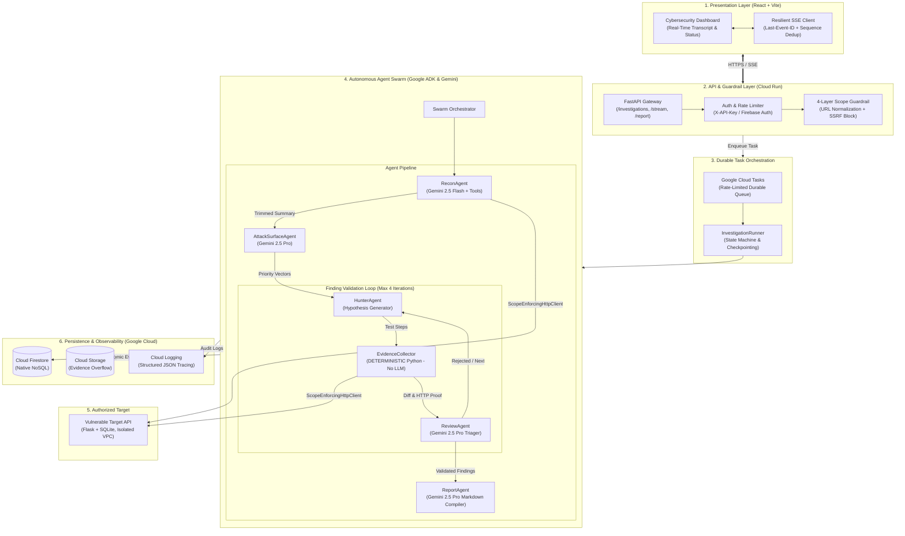
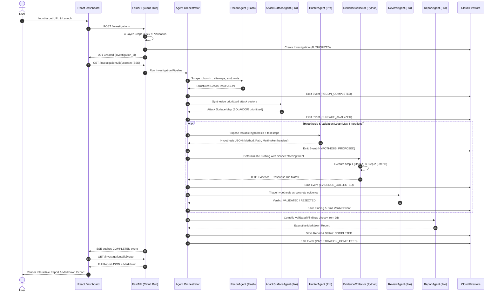

# BugBounty Swarm — Comprehensive Architecture & Technical Specification

> **Submission for**: *The All Things Agentic Hackathon* (Google Cloud & Gemini)  
> **Track**: Autonomous Multi-Agent Systems & Enterprise Heavy Lifting (The Fortified Enterprise Fleet)  
> **Core Technologies**: Google Gemini 3.5 Flash, Google GenAI SDK (`google.genai`), FastAPI, Google Cloud Run, Cloud Firestore, Cloud Storage, Server-Sent Events (SSE)

---

## 1. Executive Summary & Value Proposition

Security teams and bug bounty researchers spend **thousands of hours manually inspecting API endpoints**, diffing request parameters, checking access controls across user sessions, and writing vulnerability reports.

**BugBounty Swarm** is an autonomous, multi-agent AI system that **takes on the heavy lifting** of authorized web application security assessments. It replaces tedious manual probing with a disciplined swarm of specialized Gemini-powered agents coordinated through a deterministic validation loop.

### Key Innovations:
1. **Division of Cognitive Labor**: Specialized agents for Recon, Attack Surface Analysis, Hypothesis Generation, Strict Review, and Reporting.
2. **Deterministic Anti-Hallucination Barrier**: Unlike naive LLM agents that hallucinate attack results, our `EvidenceCollector` deterministically executes HTTP tests in Python and diffs multi-identity responses before any claim is accepted.
3. **4-Layer Scope Guardrail**: Enforces strict URL normalization, RFC 1918 / Cloud metadata (`169.254.169.254`) blocking, DNS rebinding detection, and per-request scope verification.
4. **Resilient Cloud Event Architecture**: Atomic transactional sequence numbering in Firestore with `Last-Event-ID` SSE replay and real-time streaming telemetry.

---

## 2. End-to-End System Architecture



---

## 3. Agent Pipeline & Cognitive Flow



---

## 4. Google Cloud & Gemini Integration Matrix

| Component | GCP / Gemini Technology | Role in Architecture |
|---|---|---|
| **Reconnaissance** | `gemini-2.5-flash` | High-speed structural parsing of HTML, JavaScript endpoints, and robots.txt. |
| **Attack Surface Prioritization** | `gemini-2.5-pro` | Deep contextual reasoning across OWASP API Security Top 10 vectors. |
| **Vulnerability Hypothesis** | `gemini-2.5-pro` | Formulates deterministic, multi-step HTTP attack vectors and identity swaps. |
| **Evidence Validation** | Deterministic Python Engine | **Zero Hallucination Barrier**: Strict status code and response differential evaluation. |
| **Security Triaging & Judging** | `gemini-2.5-pro` | Evaluates evidence rigorously against false positives and hallucinations. |
| **Executive Reporting** | `gemini-2.5-pro` | Generates publication-ready Markdown reports with reproduction steps & remediations. |
| **Serverless API Hosting** | **Google Cloud Run** | Auto-scaling containerized FastAPI gateway with CPU allocation for active SSE streams. |
| **State & Telemetry Store** | **Cloud Firestore (Native)** | Monotonically sequenced event logs and JSON-native findings collections. |
| **Durable Task Queue** | **Google Cloud Tasks** | Rate-limited, retryable background dispatch decoupling API requests from agent execution. |
| **Evidence Overflow Storage** | **Cloud Storage (GCS)** | Offloads large HTTP responses and report bodies exceeding Firestore document limits. |

---

## 5. Security & Ethical Guardrails

1. **Model-Armor Style Scope Filter**:
   - URL Normalization resolves trailing slashes, default ports, case differences, and path traversal (`..`).
   - Rejects non-HTTP/HTTPS protocols (`file://`, `gopher://`, `ftp://`).
2. **SSRF & Private Network Defense**:
   - Prohibits all RFC 1918 subnets (`10.0.0.0/8`, `172.16.0.0/12`, `192.168.0.0/16`), loopbacks (`127.0.0.0/8`, `::1`), and link-local cloud metadata addresses (`169.254.169.254`, `metadata.google.internal`).
3. **DNS Rebinding Prevention**:
   - Re-resolves hostnames at request time and compares against authorization-time IPs.
4. **Per-Request Enforcement**:
   - Agents are barred from raw `httpx` or `requests`. All traffic flows through `ScopeEnforcingHttpClient`.
5. **Credential & Secret Sanitization**:
   - All outgoing event payloads, logs, and agent prompts pass through a recursive regex sanitizer redacting JWT tokens, passwords, cookies, and API keys.

---

## 6. Investigation State Machine

```
CREATED
  │  (target received)
  ▼
AUTHORIZING
  │  (URL normalization, allow-list lookup, SSRF check)
  ├─► REJECTED (Terminal)
  ▼
AUTHORIZED
  │  (persisted to Firestore)
  ▼
QUEUED
  │  (Cloud Task enqueued)
  ▼
RUNNING
  │  (Agent Swarm active)
  ├──► CANCELLING ──► CANCELLED (Terminal)
  ├──► FAILED ──► RETRYING ──► RUNNING (Max 2 retries)
  │                 │
  │                 └──► FAILED (Terminal, retries exhausted)
  ▼
FINALIZING
  │  (ReportAgent compiling)
  ▼
COMPLETED (Terminal)
```
