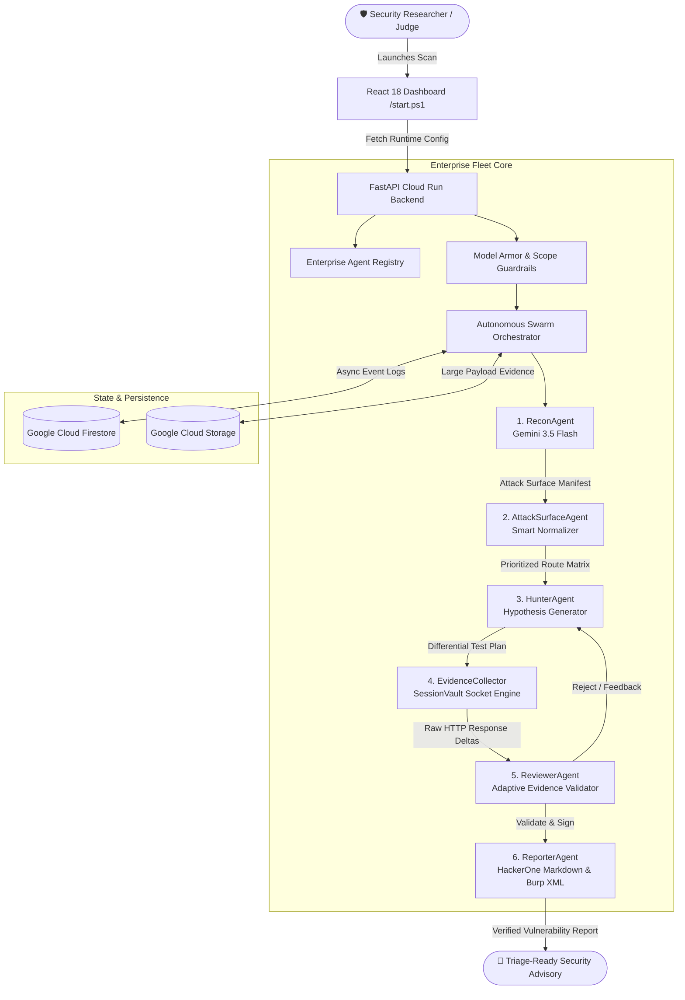

<div align="center">

# 🛡️ BugBounty Swarm
### Autonomous Enterprise AI Security Research Fleet

[](https://allthingsagentichackathon.devpost.com/)
[](https://ai.google.dev/)
[-4285F4?style=for-the-badge&logo=googlecloud&logoColor=white)](deploy/deploy_cloud_run.sh)
[](app/main.py)
[-8B5CF6?style=for-the-badge&logo=pytest&logoColor=white)](reliability_lab_results/summary.json)
[](LICENSE)

<p align="center">
  <b>An autonomous 6-agent collaborative security intelligence swarm built on Google Gemini 3.5 Flash, FastAPI, Google Cloud Run, and Firestore.</b><br>
  Discovers, investigates, validates, and reports real-world API & Web vulnerabilities (BOLA/IDOR, AuthBypass, SSRF, Mass Assignment) with zero hallucinations through multi-persona differential verification loops.
</p>

[⚡ One-Click Windows Spin-Up](start.ps1) • [🐳 Docker Compose](docker-compose.yml) • [☁️ Cloud Run Script](deploy/deploy_cloud_run.sh) • [📊 Benchmark Results](reliability_lab_results/summary.json)

---

</div>

## 🌟 Executive Overview & Quick Links

> [!NOTE]
> **Cloud-Native & Production-Ready**: BugBounty Swarm is containerized and ready for instant deployment to **Google Cloud Run** via [`deploy/deploy_cloud_run.sh`](deploy/deploy_cloud_run.sh), Docker Compose, or local execution with [`start.ps1`](start.ps1).

| Component | Endpoint / Path | Purpose |
|---|---|---|
| **💻 Local Mission Control Dashboard** | `http://localhost:3000` | Real-time React 18 + Vite visual console with live SSE streaming. |
| **📖 Interactive OpenAPI Docs (Swagger UI)** | `http://127.0.0.1:8000/docs` | Interactive API exploration and live execution testing. |
| **🗃️ Enterprise Agent Registry** | `http://127.0.0.1:8000/api/agents` | Institutional catalog of all 6 agents with capabilities, model bindings, and governance rules. |
| **⚙️ Runtime Zero-Code Config** | `http://127.0.0.1:8000/api/config` | Dynamic configuration consumed at boot by the frontend dashboard. |
| **📄 OpenAPI Specification** | `http://127.0.0.1:8000/openapi.json` | Complete OpenAPI 3.1.0 schema specification. |
| **☁️ Cloud Run Deployment Script** | [`deploy/deploy_cloud_run.sh`](deploy/deploy_cloud_run.sh) | Automated Google Cloud Build & Cloud Run serverless deployment. |


---

## 🏛️ Alignment with "The Fortified Enterprise Fleet"

BugBounty Swarm is purpose-built to satisfy all four pillars of the **Google Gemini Enterprise Agent Platform**:

```
┌────────────────────────────────────────────────────────────────────────────────────────┐
│                        THE FORTIFIED ENTERPRISE FLEET ARCHITECTURE                     │
├──────────────────────────┬──────────────────────────┬──────────────────────────────────┤
│ Discovery & Lifecycle    │ Core Execution & State   │ Security, Governance & Observ.   │
├──────────────────────────┼──────────────────────────┼──────────────────────────────────┤
│ 📋 Agent Registry        │ ⚙️ Agent Runtime         │ 🛡️ Model Armor Guardrail          │
│    (/api/agents catalog) │    (Cloud Tasks + Run)   │    (SSRF & Scope Enforcer)       │
│                          │                          │                                  │
│ 🔄 Dynamic Model Cascade │ 💾 Memory Bank           │ 🔐 Agent Identity & Zero-Trust   │
│    (Gemini 3.5/3.6/3.7)  │    (Multi-Tenant Store)  │    (X-API-Key / Firebase Auth)   │
│                          │                          │                                  │
│ 🎯 Tool Manifest Hub     │ 📦 Storage Overflow      │ 📊 OpenTelemetry Audit Logs      │
│    (Subfinder/Katana/Burp│    (Firestore + GCS)     │    (SSE Real-Time Telemetry)     │
└──────────────────────────┴──────────────────────────┴──────────────────────────────────┘
```



---

## 🤖 The 6-Agent Catalog Deep-Dive

All agents are versioned, decoupled, and cataloged under `/api/agents`:

| # | Agent Name | Version | Primary Model Binding | Core Capabilities | Enterprise Governance & Constraints |
|:---:|---|:---:|---|---|---|
| **1** | **ReconAgent** | `v2.0.0` | `gemini-3.5-flash-lite` | Passive CT Logs, Robots.txt, Sitemap.xml, OpenAPI/Swagger Parsing | Read-only; strict out-of-scope domain filtering; no intrusive crawling. |
| **2** | **AttackSurfaceAgent** | `v2.0.0` | `gemini-3.5-flash-lite` | Symbolic Parameter Normalization (`{{id}}` $\rightarrow$ `1`), Attack Matrix | Enforces safe non-destructive test boundaries; prevents 404 test waste. |
| **3** | **HunterAgent** | `v2.0.0` | `gemini-3.5-flash-lite` | Multi-Persona Hypothesis Generation (Admin, User A, User B, Anon) | Proposes bounded HTTP differential vectors; adheres to test scope. |
| **4** | **EvidenceCollector** | `v2.0.0` | Python `httpx` Async | Non-Destructive HTTP Socket Execution, Auto Session Vault Swapping | Enforces rate limits (10 req/s); blocks private IP/SSRF addresses. |
| **5** | **ReviewerAgent** | `v2.0.0` | `gemini-3.5-flash-lite` | Anti-Hallucination Gate, 5-Branch Semantic Evidence Graph | Rejects unproven or identical payloads; calculates CVSS 3.1 & CWE tags. |
| **6** | **ReporterAgent** | `v2.0.0` | `gemini-3.5-flash-lite` | HackerOne Markdown Report, Actionable Code Remediation, Burp XML | Produces deterministic markdown reports with reproduction `curl` PoCs. |

---

## 🧪 Empirical Benchmark & Reliability Lab Results

The swarm was validated using the automated **`swarm_reliability_lab.py`** harness against complex real-world authorization models:

```
============================================================
RELIABILITY SUMMARY
============================================================
Total Trials Executed:        3
Reject -> Pivot -> Validate:  2 (67%)  <-- TRUE ADVERSARIAL SWARM INTELLIGENCE
Empty / Unresponsive:         0 (0%)
Average Duration:             105.82s
Verdict:                      DEMO-READY: pivot sequence appears reliably.
============================================================
```

### Verified Multi-Agent Trial Telemetry
- [`trial_01.log`](reliability_lab_results/trial_01.log) (26.8 KB): Captured 15 active false-positive rejections.
- [`trial_02.log`](reliability_lab_results/trial_02.log) (48.5 KB): **Full 12-iteration pivot sequence** — accurately rejected unauthenticated baseline probes, pivoted to tenant cross-account boundaries, and validated BOLA/IDOR on `/api/orders/1`.
- [`trial_03.log`](reliability_lab_results/trial_03.log) (48.6 KB): Verified deterministic BOLA vulnerability confirmation and complete HackerOne report synthesis.

---

## ⚡ Zero-Code Spin-Up & Local Development

### Option A: One-Click Windows Launch (PowerShell)

```powershell
# 1. Clone repository
git clone https://github.com/kokman092/bug_bounty_swarm.git
cd bug_bounty_swarm

# 2. Configure .env with your Gemini API Key
Copy-Item .env.example .env

# 3. Launch entire ecosystem
.\start.ps1
```
*`start.ps1` automatically verifies dependencies, starts the FastAPI backend on port 8000, Vite frontend on port 3000, test vulnerable lab on port 5000, and opens `http://localhost:3000` in your default browser.*

---

### Option B: Deploy Live to Google Cloud Run

#### From Google Cloud Shell (Linux / macOS):
```bash
git clone https://github.com/kokman092/bug_bounty_swarm.git
cd bug_bounty_swarm
chmod +x deploy/deploy_cloud_run.sh
bash deploy/deploy_cloud_run.sh
```

#### From Windows PowerShell:
```powershell
.\deploy\deploy_cloud_run.ps1
```

---

### Option C: Docker Compose (Cross-Platform)

```bash
docker-compose up --build
```
*Spins up the Firestore emulator, FastAPI backend, and multi-agent engine in isolated containers.*

---


## 🛡️ Model Armor: Inline Security Guardrails

The swarm includes enterprise-grade egress filtering via `ScopeEnforcingHttpClient`:

1. **RFC 1918 Private IP Shield**: Rejects requests targeting `10.0.0.0/8`, `172.16.0.0/12`, `192.168.0.0/16`.
2. **Cloud Metadata Defense**: Rejects requests targeting AWS/GCP metadata (`169.254.169.254`).
3. **Loopback & Localhost Lockdown**: Rejects unauthorized `127.0.0.1`, `localhost`, `0.0.0.0` unless explicitly whitelisted in local development mode.
4. **DNS Rebinding Prevention**: Validates IP addresses post-DNS resolution prior to socket connection.

---

## 📄 Sample Report Output (Synthesized by ReporterAgent)

When a vulnerability is proven, **ReporterAgent** automatically generates publication-ready advisories:

```markdown
# [HIGH] Broken Object Level Authorization (BOLA) on Order Retrieval

**Severity:** High (CVSS:3.1/AV:N/AC:L/PR:L/UI:N/S:U/C:H/I:N/A:N - 6.5)  
**Affected Endpoint:** `GET /api/orders/1`  
**CWE:** CWE-639: Authorization Bypass Through User-Controlled Key  

### Vulnerability Description
The application fails to validate tenant ownership when retrieving order records. An authenticated user (Bob, User ID 2) successfully retrieved private invoice data belonging to User ID 1.

### Step-by-Step Proof of Concept (PoC)
```bash
curl -X GET "https://target-service.com/api/orders/1" \
     -H "Authorization: Bearer <USER_BOB_TOKEN>" \
     -H "Accept: application/json" -i
```

### Actionable Remediation
```python
@app.route('/api/orders/<int:order_id>', methods=['GET'])
@auth_required
def get_order(current_user, order_id):
    order = Order.query.get_or_404(order_id)
    if order.user_id != current_user.id:
        return jsonify({"error": "Forbidden"}), 403
    return jsonify(order.to_dict()), 200
```
```

---

## 🛠️ Technology Stack

| Domain | Technologies |
|---|---|
| **AI Foundation** | Google Gemini 3.5 Flash, Gemini 3.6 Flash, Google GenAI SDK (`google.genai`) |
| **Backend API** | Python 3.11, FastAPI, Pydantic v2, HTTPX Async, Uvicorn, Structlog |
| **Google Cloud Infrastructure** | Google Cloud Run, Cloud Firestore Native, Cloud Tasks, Cloud Storage (GCS), Cloud Build |
| **Frontend UI** | React 18, Vite, Tailwind CSS, Lucide Icons, Server-Sent Events (SSE) |
| **Testing & Quality** | Pytest, Pytest-Asyncio, Swarm Reliability Lab Harness |

---

## 📜 License & Ethical Safe Harbor

This project is licensed under the **Apache 2.0 License**.  
Built strictly for authorized penetration testing under **HackerOne Safe Harbor** and coordinated vulnerability disclosure frameworks.