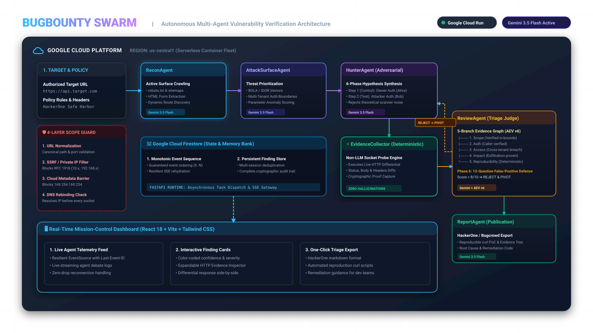

# BugBounty Swarm — Autonomous AI Security Assessment Swarm

[](https://bugbounty-swarm-339717745624.us-central1.run.app/)
[](https://allthingsagentichackathon.devpost.com/)
[](https://ai.google.dev/)

An enterprise-grade, multi-agent AI system for authorized web vulnerability assessments built on **Google Gemini 3.5 Flash**, **FastAPI**, **Firestore**, and **Google Cloud Run**.

**Live Google Cloud Run Production URL**: [https://bugbounty-swarm-339717745624.us-central1.run.app/](https://bugbounty-swarm-339717745624.us-central1.run.app/)

---

## 1. System Architecture (Hardened & Modular)



```
┌─────────────────────────────────────────────────────────────────────────┐
│                           FRONTEND (React + Vite)                       │
│  - Real-time agent status tracker                                       │
│  - SSE stream with Last-Event-ID reconnection replay & deduplication    │
│  - One-click HackerOne Markdown report export                           │
└────────────────────────────────────┬────────────────────────────────────┘
                                     │ HTTPS / SSE
┌────────────────────────────────────▼────────────────────────────────────┐
│                             BACKEND API                                 │
│  FastAPI Gateway (Cloud Run)                                            │
│   - POST   /investigations          → Scope check + durable task dispatch│
│   - GET    /investigations/{id}     → Investigation state & phase       │
│   - DELETE /investigations/{id}     → Graceful cancellation             │
│   - GET    /investigations/{id}/stream → Resilient SSE event stream     │
│   - GET    /investigations/{id}/report → Final assessment report        │
│   - GET    /healthz                 → Health probe                      │
│                                                                         │
│  ┌───────────────────────────────────────────────────────────────────┐  │
│  │                     4-LAYER SCOPE GUARDRAIL                       │  │
│  │  1. Canonical URL Normalization (scheme, port, path, traversal)   │  │
│  │  2. SSRF / Private IP Blocking (RFC 1918, metadata, loopback)     │  │
│  │  3. DNS Rebinding Detection (re-resolve at request time)          │  │
│  │  4. Enforced on EVERY HTTP request (ScopeEnforcingHttpClient)      │  │
│  └───────────────────────────────────────────────────────────────────┘  │
│                                                                         │
│  ┌───────────────────────────────────────────────────────────────────┐  │
│  │                     MULTI-AGENT PIPELINE                          │  │
│  │                                                                   │  │
│  │  ReconAgent ──(trimmed context)──► AttackSurfaceAgent             │  │
│  │                                          │                        │  │
│  │                      ┌───────────────────▼──────────────────┐     │  │
│  │                      │ Finding Validation Loop (Max 4 iters)│     │  │
│  │                      │                                      │     │  │
│  │                      │ HunterAgent (Hypothesis + test steps)│     │  │
│  │                      │    ↓                                 │     │  │
│  │                      │ EvidenceCollector (DETERMINISTIC)    │     │  │
│  │                      │    ↓                                 │     │  │
│  │                      │ ReviewAgent (Anti-hallucination)     │     │  │
│  │                      └───────────────────┬──────────────────┘     │  │
│  │                                          │                        │  │
│  │                                          ▼                        │  │
│  │                      ReportAgent (Synthesizes validated findings) │  │
│  └───────────────────────────────────────────────────────────────────┘  │
└─────────────────┬───────────────────────────────────┬───────────────────┘
                  │                                   │
                  ▼                                   ▼
┌─────────────────────────────────┐   ┌───────────────────────────────────┐
│     FIRESTORE & CLOUD STORAGE   │   │        VULNERABLE LAB TARGET      │
│  - investigations               │   │  Flask App (Isolated container)   │
│  - agent_events (sequence nos)  │   │  4 planted vulnerabilities:       │
│  - findings                     │   │   1. IDOR on /api/orders/<id>     │
│  - reports                      │   │   2. IDOR on /api/invoices/<id>   │
│  - GCS evidence overflow (>16KB)│   │   3. Debug metadata disclosure    │
│  - authorized_targets           │   │   4. Admin role authorization     │
└─────────────────────────────────┘   └───────────────────────────────────┘
```

---

## 2. Key Architectural Highlights

| Subsystem | Design Strategy | Benefit |
|---|---|---|
| **Target Security** | `ScopeEnforcingHttpClient` on every tool request | Prevents SSRF, cloud metadata theft (`169.254.169.254`), and DNS rebinding |
| **Evidence Probing** | Deterministic `EvidenceCollector` (No LLM) | Eliminates hallucinated HTTP requests and ensures reproducible proof |
| **Event Streaming** | Atomic sequence numbers + `Last-Event-ID` | Guarantees event ordering and seamless reconnection replay |
| **Context Hygiene** | Structured summary passing & direct DB reads | Prevents token explosion across loop iterations |
| **State Machine** | 10 formal states with strict transition checks | Idempotent, cancellable, and retryable investigation lifecycle |
| **Storage Overflow** | Inline (<16KB) + GCS pointer (>16KB) | Avoids Firestore 1MB document limit exhaustion |

---

## 3. Directory Layout

```
bugbounty-swarm/
├── app/
│   ├── core/                  # Configuration, logging, exception models, auth
│   ├── db/                    # Firestore singleton & Cloud Storage client
│   ├── targets/               # URL normalization, SSRF guardrail, scope authorization
│   ├── tools/                 # ScopeEnforcingHttpClient, recon & evidence tools
│   ├── investigations/        # Domain state machine, service, runner, API router
│   ├── events/                # Event schema, sequence assigner, SSE streaming router
│   ├── findings/              # Vulnerability findings schemas & dedup service
│   ├── reports/               # Final report schemas, service, API router
│   ├── agents/                # Prompts, config, Recon, AttackSurface, Hunter, EvidenceCollector, Reviewer, Reporter, Orchestrator
│   └── main.py                # FastAPI entry point & CORS
│
├── vuln_lab/                  # Intentionally vulnerable target application
├── frontend/                  # React + Vite + Tailwind dashboard
├── deploy/                    # Dockerfiles, Cloud Run & Cloud Tasks configs
├── tests/                     # Unit, integration, and E2E vuln_lab test suites
├── docker-compose.yml         # Local dev orchestration
├── requirements.txt           # Python dependencies
└── pyproject.toml             # Project build configuration
```

---

## 4. Quickstart

### Local Development

1. **Configure Environment:**
   ```bash
   cp .env.example .env
   # Edit .env and supply your GEMINI_API_KEY and API_SECRET_KEY
   ```

2. **Run with Docker Compose:**
   ```bash
   docker compose up --build
   ```
   - Backend API: `http://localhost:8000/docs`
   - Frontend Dashboard: `http://localhost:3000`
   - Vulnerable Lab: `http://localhost:5000`
   - Firestore Emulator: `localhost:8080`

3. **Run Automated Test Suite:**
   ```bash
   pytest -v
   ```

---

## 5. Security & Safe Harbor

This system is configured for **authorized penetration testing and bug bounty research**.
- Every target URL must be explicitly authorized.
- Internal addresses (`localhost`, `127.0.0.1`, `10.0.0.0/8`, `192.168.0.0/16`, `169.254.169.254`, metadata services) are rejected by default.
- All HTTP requests made by agents are validated individually at runtime.